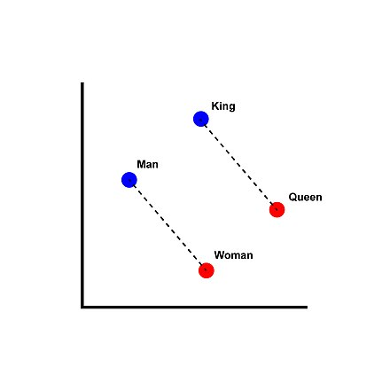
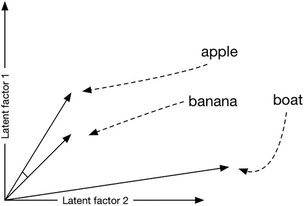

### Llama 3

* [LLaMA (Large Language Model Meta AI)](https://fr.wikipedia.org/wiki/LLaMA) (Wikipedia)
* Interroger Llama 3: https://ai-tools.infomaniak.com/ 

  * qu'est-ce que le patrimoine horloger?
  * Quels sont les trois meilleurs ouvrages concernant le patrimoine horloger?
  * première marque suisse de montres

* [Swisscovery](https://swisscovery.slsp.ch) : moteur d'agrégation des notices bibliographiques de bibliothèques suisses
* [Dictionnaire historique de la Suisse](https://hls-dhs-dss.ch/fr/articles/013976/2020-08-11/#HOriginesdeladiffusiondel27horlogerieenSuisse): Horlogerie.

### Méthode de *Plongement lexical —* « **word embedding** » ([Wikipedia](https://fr.m.wikipedia.org/wiki/Plongement_lexical))

Vectorisation de mots pour les techniques d'apprentissage automatique

“Cette technique permet de représenter chaque mot d'un dictionnaire par un [vecteur](https://fr.m.wikipedia.org/wiki/Vecteur "Vecteur") de [nombres réels](https://fr.m.wikipedia.org/wiki/Nombre_r%C3%A9el "Nombre réel"). Cette nouvelle représentation a ceci de particulier que les mots apparaissant dans des *contextes similaires* possèdent des vecteurs correspondants qui sont relativement proches. Par exemple, on pourrait s'attendre à ce que les mots « chien » et « chat » soient représentés par des vecteurs relativement peu [distants](https://fr.m.wikipedia.org/wiki/Distance_(math%C3%A9matiques) "Distance (mathématiques)") dans l'[espace vectoriel](https://fr.m.wikipedia.org/wiki/Espace_vectoriel "Espace vectoriel") où sont définis ces vecteurs.” ([Wikipedia](https://fr.m.wikipedia.org/wiki/Plongement_lexical))

Un exemple de vecteur:

[Vecteur](https://fr.m.wikipedia.org/wiki/Vecteur): élément d'un espace vectoriel, sur lequel on peut effectuer des combinaisons linéaires

L’article “Plongement lexical” de Wikipedia contient un exposé de l’historique et du fonctionnement de cette méthode, notamment concernant la présentation des réseaux neuronaux utilisés pour produire les vecteurs multidimensionnels.

“Par exemple, un chat sera représenté par le vecteur **[0,43 0,88 0,98 1,3]**. Si l'on encode tous les mots d'un dictionnaire ainsi, il devient alors possible de comparer les vecteurs des mots entre eux, par exemple en mesurant l'[angle entre les vecteurs](https://fr.m.wikipedia.org/wiki/Similarit%C3%A9_cosinus "Similarité cosinus"). Une bonne représentation de mots permettra alors de trouver que le mot « chien » est plus près du mot « chat » qu'il ne l'est du mot « gratte-ciel »[[4]](https://fr.m.wikipedia.org/wiki/Plongement_lexical#cite_note-:0-4). Qui plus est, ces représentations permettent d'espérer que, dans l'espace vectoriel où le plongement est fait, on aura l'équation *roi - homme + femme = reine* ou encore l'équation *Paris - France + Pologne = Varsovie*[[5]](https://fr.m.wikipedia.org/wiki/Plongement_lexical#cite_note-5).” (Wikipedia)

L’exemple classique de la méthode Word2vec:

Illustration du plongement lexical dans un espace vectoriel réduit à deux dimensions ([Wikipedia](https://en.wikipedia.org/wiki/Word2vec))

### Méthode appliqué à l’histoire

Wevers Melvin et Koolen Marijn, « [Digital begriffsgeschichte: Tracing semantic change using word embeddings](https://doi.org/10.1080/01615440.2020.1760157) », *Historical Methods: A Journal of Quantitative and Interdisciplinary History* 53 (4), 01.10.2020, pp. 226‑243.

Figure 2. La proximité est représentée par la distance cosinus, qui indique l'angle entre deux vecteurs le long de deux ou plusieurs dimensions […]. Un angle plus petit indique des mots sémantiquement similaires ; dans ce cas, "pomme" et "banane".

“La **similarité cosinus** donne la similarité de deux [vecteurs](https://fr.m.wikipedia.org/wiki/Vecteur "Vecteur") à *n* dimensions en déterminant le cosinus de leur angle. Ce score est fréquemment utilisée en [fouille de textes](https://fr.m.wikipedia.org/wiki/Fouille_de_textes "Fouille de textes")[[1]](https://fr.m.wikipedia.org/wiki/Similarit%C3%A9_cosinus#cite_note-1). Soit deux vecteurs *A* et *B*, le cosinus de leur angle θ s'obtient en prenant leur [produit scalaire](https://fr.m.wikipedia.org/wiki/Produit_scalaire "Produit scalaire") divisé par le produit de leurs [normes](https://fr.m.wikipedia.org/wiki/Norme_(math%C3%A9matiques) "Norme (mathématiques)") : cos ⁡ θ = A ⋅ B / ‖ A ‖ ‖ B ‖ . La valeur d'un cosinus, donc celle calculée ici pour cos θ, est comprise dans l'intervalle [-1,1].  
La valeur de -1 indique des vecteurs opposés, la valeur de 0 des vecteurs indépendants (orthogonaux) et la valeur de 1 des vecteurs [colinéaires](https://fr.m.wikipedia.org/wiki/Colin%C3%A9arit%C3%A9 "Colinéarité") de coefficient positif. Les valeurs intermédiaires permettent d'évaluer le degré de similarité.” ([Wikipedia](https://fr.m.wikipedia.org/wiki/Similarit%C3%A9_cosinus)).

### Le fonctionnement de la production des vecteurs

Illustration Wikipedia: The Continuous Bag-of-Words (CBOW): Le modèle *continuous bag-of-words* (sac de mots continu) cherche à prédire un mot à partir de ses mots voisins, par exemple prédire *attrape* dans l'extrait *le chat ____ la souris*.

Cf. [Réseau de neurones artificiels](https://fr.wikipedia.org/wiki/R%C3%A9seau_de_neurones_artificiels) (Wikipedia)

Cf. l’article de blog de Ben Schmidt: [Word Embeddings for the Digital Humanities](http://bookworm.benschmidt.org/posts/2015-10-25-Word-Embeddings.html) (25 octobre 2015)