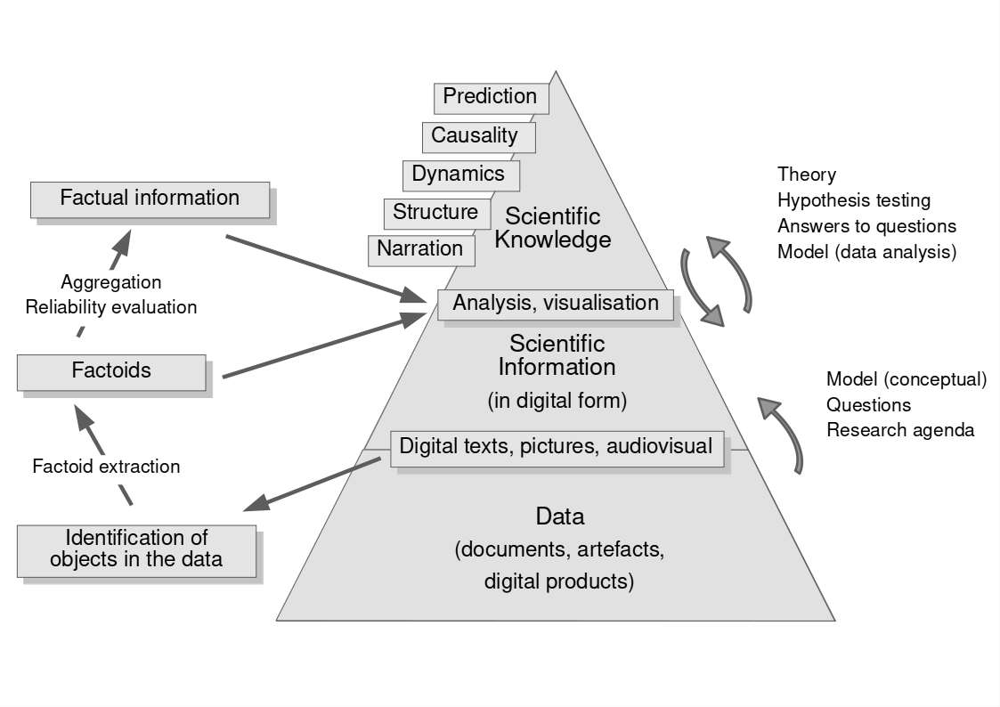

# Pyramide données, information, savoir

* [DIKW pyramid](https://en.wikipedia.org/wiki/DIKW_pyramid) (Wikipedia)
* Jennifer E. Rowley, « [The wisdom hierarchy: representations of the DIKW hierarchy.](https://doi.org/10.1177/0165551506070706) », J. Inf. Sci. 33, nᵒ 2 (2007): 163‑80.
* Beretta Francesco, « [Conceptualising Information Production in the Context of the SDHSS Ontology Ecosystem](https://doi.org/10.4000/12xqn) », Methodos : savoirs et textes 24, 16.12.2024.

